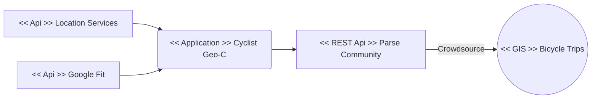

# Cyclist Geo-C! 

TThe **“Cyclist Geo-C”**  is part of the [Open City Toolkit](http://geo-c.eu/opencitytoolkit), a collection of tools, processes, specifications and guidelines to empower citizens to participate in and shape the future of their cities (see Degbelo et al., 2016a,b).

This geo-game allows users to track their bicycle trips and describe them with up to three tags upon arrival. It offers two different interfaces: the **collaboration-based** interface that calculates participants’ contribution to the city as the percentage of trips and tags recorded; and the **competition-based interface** that calculates participants’ position on a leaderboard based on the number of trips recorded.  

 

**Cyclist Geo-C** randomly assigns one of the two interfaces to a new participant. It provides different modules to control trips’ records, choose up to three tags upon arrival, set up a user profile, check the dashboard, and the leaderboard (visible only for the competition-based interface). The application supports four languages: English, European Spanish, German and Catalan.

Mobile application interfaces for participants

# Experiment Deployment

This experimental geo-game has supported experimental deployments in the cities of **Castelló** in Spain, **Münster** in Germany, and **Valletta** in Malta. Participants were required to be Android phone users as well as to meet the researchers to install the application, receive the instructions for the experiment, and provide feedback after one week of use. Participants were told to install the **Cyclist Geo-C** mobile application, record each bicycle trip and describe it with up to three tags upon arrival following their normal daily routine (Pajarito, Degbelo & Gould, 2018).

# App in play store

Get **Cyclist Geo-C** from the Google Play Store [here](https://play.google.com/store/apps/details?id=geoc.uji.esr7.mag_ike)

# Open Architecture

The following is a simplified representation of the app architecture supporting the crowdsourced data collection of bicycle trips:

# References

Degbelo, A., Bhattacharya, D., Granell, C., & Trilles, S. (2016). **Toolkits for smarter cities: A brief assessment**. In C. R. García, P. Caballero-Gil, M. Burmester, & A. Quesada-Arencibia (Eds.), Lecture Notes in Computer Science (including subseries Lecture Notes in Artificial Intelligence and Lecture Notes in Bioinformatics) (Vol. 10070 LNCS, pp. 431–436). Springer, Cham. http://doi.org/10.1007/978-3-319-48799-1_47

Degbelo, A., Granell, C., Trilles, S., Bhattacharya, D., Casteleyn, S., & Kray, C. (2016). **Opening up Smart Cities: Citizen-Centric Challenges and Opportunities from GIScience**. ISPRS International Journal of Geo-Information, 5(2), 16. http://doi.org/10.3390/ijgi5020016

Pajarito, D., Degbelo, A. & Gould, M., **Collaboration or Competition: the Impact of Incentive Types on Urban Cycling**. Submitted for publication.
